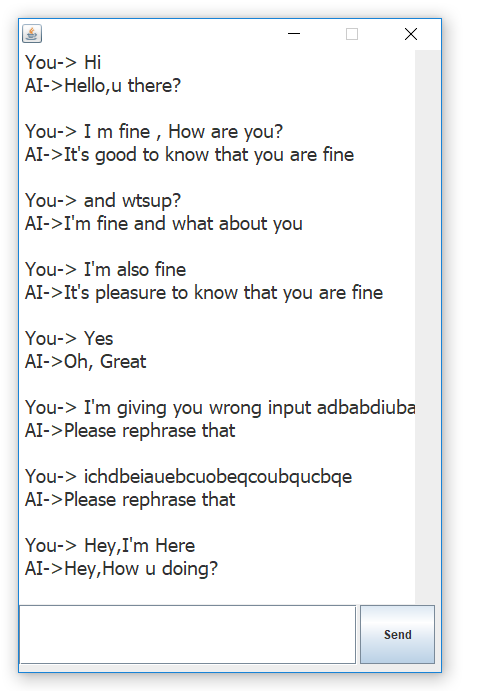
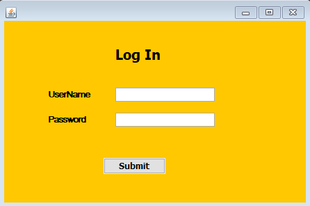
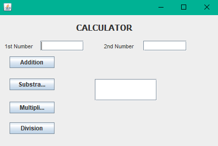
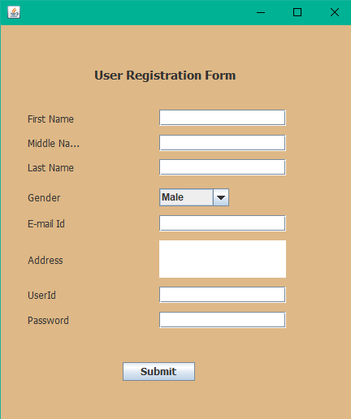

# JavaFx-Swing-Projects (GUI Desktop Application/Projects)
All projects are based on ☕ Java(Swing.All projects are database(MySql) connected📂 and compatible to run is🖥️ Desktop(with .exe)🖱️.All projects have a Graphical User Interface(GUI)👨🏻‍💻 that user can communicate and understand the application easily).

# How to run this project?

**Step 1:** Download this repository in your PC.

**Step 2:** Go to Set Path/--.zip. Unzip the file.

**Step 3:**  Go to your lib of installed java location of your system, (in my case, it's "C:\Program Files\Java\jre1.8.0_121\lib") and create a folder name UCanAccess-4.0.4-bin and paste all the four files into this folder.

**Step 5**: Now create a path for your four jar files, just like given in Set Path/Path.txt and copy that whole path string.

**Step 6:** Go to your System's Environment Variables. Create a new user variable name CLASSPATH and copy that path string into it and save it.

**Step 7:** Restart your pc.

**Step 8:** Run any JAVA SWING program from src file.(src/---.java)

# Eclipse Major File Bug (OEPEArtifactContentProvider$OEPEArtifactContainer)
Do:- Window->Open Perspective->Other->Java (default)

# Software Output

# ------------------------Realtime Chatbot-----------------------

# ------------------------Log In Form------------------------

  

# ------------------------Calculator------------------------

  

# #Java Software (Swing/JDBC/MySql)

- [User Registration System](https://github.com/uakp98/Java-JavaFx-Swing-Projects-DesktopApplication-GUI-Software/tree/main/User%20Registration%20System)

  

/*- [Java Swing Complete tutorial with example for JavaGuides.net](https://github.com/soumyadip007/Java-Swing-tutorials-and-examples-for-JavaGuides.net)*/
